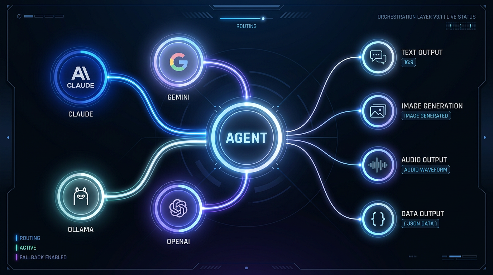

# daz-agent-sdk

**One library for all your AI needs.** Text, images, speech — from any provider, with automatic fallback if one goes down.

Stop writing boilerplate. Stop worrying about rate limits. Just tell it what you need.

```python
from daz_agent_sdk import agent

answer = await agent.ask("Explain quantum tunnelling in one paragraph")
```

That's it. Behind the scenes, daz-agent-sdk picks the best available model, handles errors, and falls back to another provider if anything goes wrong. You never write retry logic again.

---

## Getting Started

```bash
# Clone and install
git clone <repo-url> && cd daz-agent-sdk
./run install
```

This installs daz-agent-sdk as an editable package so you can `import daz_agent_sdk` from anywhere.

**Quick test from the command line:**

```bash
./run ask "What's the capital of France?"
```

**Or in Python:**

```python
from daz_agent_sdk import agent

answer = await agent.ask("What's the capital of France?")
print(answer.text)
```

---

## What Can It Do?

### Ask Questions

The simplest thing — ask a question, get an answer.

```python
answer = await agent.ask("Summarise this article", tier=Tier.LOW)
print(answer.text)
```

Use **tiers** to balance quality vs. speed:

| Tier | What You Get | When to Use |
|------|-------------|-------------|
| `Tier.HIGH` | Best available model (default) | Important tasks, creative writing |
| `Tier.MEDIUM` | Balanced quality and speed | Most everyday tasks |
| `Tier.LOW` | Fast and cheap | Summaries, simple classification |
| `Tier.FREE_FAST` | Local models, zero cost | Bulk processing, prototyping |
| `Tier.FREE_THINKING` | Local models, deeper reasoning | Complex local analysis |

### Get Structured Data Back

Pass a Pydantic model and get validated, typed data — not just text.

```python
from pydantic import BaseModel

class Sentiment(BaseModel):
    label: str        # positive, negative, neutral
    confidence: float

result = await agent.ask(
    "Classify: 'I love this product'",
    schema=Sentiment,
    tier=Tier.LOW,
)
print(result.parsed.label)       # "positive"
print(result.parsed.confidence)  # 0.95
```

### Have a Conversation

Multi-turn conversations that remember context.

```python
async with agent.conversation("writing-session") as chat:
    outline = await chat.say("Write an outline for a thriller novel")

    chapter = await chat.say("Now write chapter 1 based on that outline")

    # Stream long responses chunk by chunk
    async for chunk in chat.stream("Write chapter 2"):
        print(chunk, end="", flush=True)
```

Conversations handle rate limits transparently — if your provider goes down mid-conversation, daz-agent-sdk backs off, summarises the conversation so far, and picks up seamlessly on another provider.

### Generate Images

```python
result = await agent.image(
    "A cyberpunk city at sunset",
    width=1024,
    height=1024,
    output="city.jpg",
)
print(result.path)
```

Tier controls quality here too — `HIGH` gives you more detail, `LOW` gives you a quick draft in seconds.

```python
# Quick draft for previewing (~5 seconds)
draft = await agent.image("Robot logo", tier=Tier.LOW)

# Transparent background
logo = await agent.image("Company logo", transparent=True, output="logo.png")
```

### Text-to-Speech

Turn text into spoken audio.

```python
audio = await agent.speak(
    "Welcome to the show, folks.",
    voice="gary",
    output="intro.mp3",
)
```

### Speech-to-Text

Transcribe audio files.

```python
text = await agent.transcribe("recording.wav")
print(text)
```

### See What's Available

List all models you can use right now.

```python
all_models = await agent.models()

# Filter by what you need
local_models = await agent.models(provider="ollama")
fast_text = await agent.models(tier=Tier.LOW, capability=Capability.TEXT)
```

---

## Using the CLI

You don't need to write Python to use daz-agent-sdk.

```bash
# Ask a question
./run ask "What year was Python created?"

# Pick a tier
./run ask --tier low "Summarise this paragraph: ..."

# List available models
./run models
```

---

## Configuration

daz-agent-sdk works with **zero configuration** — it picks sensible defaults automatically.

If you want to customise things, create `~/.daz-agent-sdk/config.yaml`:

```yaml
# Map tiers to your preferred providers
tiers:
  high:
    - claude:claude-opus-4-6
    - gemini:gemini-2.5-pro
  medium:
    - claude:claude-sonnet-4-6
    - gemini:gemini-2.5-flash
  low:
    - claude:claude-haiku-4-5-20251001
    - ollama:qwen3-8b
  free_fast:
    - ollama:qwen3-8b

# Provider settings
providers:
  ollama:
    base_url: http://localhost:11434
  gemini:
    api_key_env: GEMINI_API_KEY
```

Each tier lists providers in order of preference. If the first one fails, it tries the next. You choose what "best" means for your setup.

---

## Supported Providers

| Provider | What You Need |
|----------|--------------|
| **Claude** | Anthropic API access (or Claude Code auth) |
| **Codex** | OpenAI API key |
| **Gemini** | Google AI API key |
| **Ollama** | Ollama running locally (`ollama serve`) |

Don't have all of them? No problem. daz-agent-sdk skips any provider that isn't available and uses what you've got.

---

## Automatic Fallback

This is the killer feature. You never write retry logic.

**For single questions:** If your preferred provider hits a rate limit, daz-agent-sdk immediately tries the next one. No delay, no waiting.

**For conversations:** It tries exponential backoff first (maybe the rate limit clears in a few seconds). If that doesn't work, it summarises the conversation and seamlessly continues on another provider. Your code never knows the switch happened.

**Auth errors** skip the provider entirely. **Bad requests** (your bug) raise immediately so you can fix them. Everything is logged so you can debug later.

---

## Logging

Every conversation is automatically logged to `~/.daz-agent-sdk/logs/`. Each conversation gets its own folder with:

- What was said
- Which models were used
- Any fallbacks that happened
- Timing and token usage

Useful for debugging, cost tracking, or just seeing what happened.

---

## Tips and Tricks

**Start with defaults.** Don't configure anything until you need to. `Tier.HIGH` and zero config will get you going immediately.

**Use tiers, not provider names.** Say `Tier.LOW` instead of hardcoding `ollama:qwen3-8b`. That way you can swap providers later without changing any code.

**Use structured output for anything machine-readable.** Instead of parsing text with regex, pass a Pydantic schema and get clean, validated data back.

**Stream long responses.** For anything that might take a while (long text generation, creative writing), use `chat.stream()` so the user sees progress immediately.

**Fork conversations to explore alternatives.** Working on something creative? Fork the conversation to try a different direction without losing where you were.

```python
async with agent.conversation("brainstorm") as chat:
    await chat.say("Give me three story ideas")

    branch_a = chat.fork("dark-thriller")
    branch_b = chat.fork("comedy")

    await branch_a.say("Develop the first idea as a dark thriller")
    await branch_b.say("Develop the first idea as a comedy")
```

**Use `FREE_FAST` for bulk work.** Processing hundreds of items? Local models cost nothing and won't rate-limit you.

**Let the fallback do its job.** Don't try to handle provider errors yourself. That's what daz-agent-sdk is for.