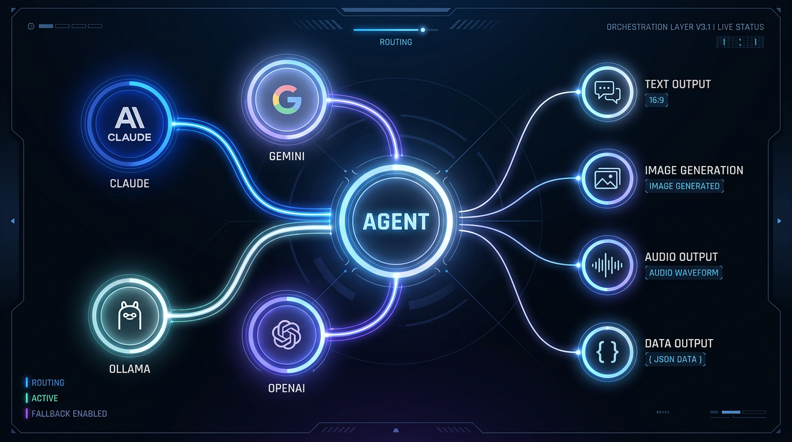

# daz-agent-sdk

Your AI Swiss Army knife. One library handles text-provider routing, durable Codex image jobs, and speech without provider-specific boilerplate.

```python
from daz_agent_sdk import agent

answer = await agent.ask("Explain quantum tunnelling in one paragraph")
print(answer.text)
```

That's genuinely all it takes. For text, daz-agent-sdk figures out which model to use and can try another provider after transient failures. Image jobs never cascade to another backend.

---

## Why You'll Love It

Most AI projects end up drowning in boilerplate: retry logic, provider-specific SDKs, response parsing, error handling, and hardcoded model names scattered across files. daz-agent-sdk replaces all of that with a single, consistent interface.

You describe **what** you need — a quick answer, a structured result, a long conversation, an image, some audio — and daz-agent-sdk handles the rest. Text supports provider routing; images deliberately use one durable service with no fallback.

---

## Installation

```bash
pip install daz-agent-sdk
```

For local development:

```bash
git clone https://github.com/darrenoakey/daz-agent-sdk
cd daz-agent-sdk
./run install
```

Test it immediately from the command line:

```bash
daz-agent-sdk ask "What's the capital of France?"
```

---

## Getting Started

Everything lives on the `agent` object. Import it and you're ready:

```python
from daz_agent_sdk import agent, Tier
```

No setup, no API key wrangling, no configuration required to get going. It picks sensible defaults automatically.

---

## Features

### Ask a Question

The most common thing you'll do. Ask something, get a text answer back.

```python
answer = await agent.ask("What are three tips for better sleep?")
print(answer.text)
```

### Choose Your Quality Level

Not every question needs the most powerful (and most expensive) model. Use **tiers** to match quality to the task:

| Tier | What You Get | Best For |
|------|-------------|----------|
| `Tier.HIGH` | Best available model (this is the default) | Important work, creative projects |
| `Tier.MEDIUM` | Great quality, faster | Everyday tasks |
| `Tier.LOW` | Fast and economical | Summaries, simple classification |
| `Tier.FREE_FAST` | Local models, completely free | Bulk processing, drafts |
| `Tier.FREE_THINKING` | Local models with deeper reasoning | Complex analysis without cloud costs |

```python
# Quick and cheap — great for processing lots of items
summary = await agent.ask("Summarise this article: ...", tier=Tier.LOW)

# Free, runs entirely on your machine
tag = await agent.ask("Tag this email as urgent/normal/low", tier=Tier.FREE_FAST)
```

### Get Structured Data Back

Instead of parsing text responses yourself, describe the shape of the data you want using a Pydantic model and get clean, validated results back.

```python
from pydantic import BaseModel

class Sentiment(BaseModel):
    label: str        # "positive", "negative", or "neutral"
    confidence: float

result = await agent.ask(
    "Classify the sentiment: 'I love this product!'",
    schema=Sentiment,
    tier=Tier.LOW,
)

print(result.parsed.label)       # "positive"
print(result.parsed.confidence)  # 0.95
```

No regex. No JSON parsing. No surprises. Works with any Pydantic model you define.

### Have a Conversation

For tasks that take multiple back-and-forths, use a conversation. It remembers everything you've said.

```python
async with agent.conversation("writing-helper") as chat:
    outline = await chat.say("Write an outline for a thriller novel set in Tokyo")
    chapter1 = await chat.say("Write chapter 1 based on that outline")
    
    # Stream long responses so you see them arrive in real time
    async for chunk in chat.stream("Now write chapter 2"):
        print(chunk, end="", flush=True)
```

Conversations handle rate limits and provider hiccups transparently. If your provider goes down mid-conversation, daz-agent-sdk backs off, summarises what you've discussed so far, and seamlessly continues on another provider. Your code never knows the switch happened.

### Fork a Conversation to Explore Alternatives

Working on something creative and want to explore two different directions without losing your place? Fork the conversation.

```python
async with agent.conversation("brainstorm") as chat:
    await chat.say("Give me a premise for a short story about a lighthouse keeper")

    # Explore two different directions from the same starting point
    spooky = chat.fork("horror-version")
    funny = chat.fork("comedy-version")

    await spooky.say("Develop this as a ghost story")
    await funny.say("Develop this as a comedy")
```

### Generate Images

Still-image generation and editing use only the durable Mac mini Codex image service at `http://10.0.0.46:8830`. The origin is hard-pinned and caller overrides are not accepted. HTTP uses the signed system `/usr/bin/curl` transport so macOS Local Network privacy cannot selectively deny an unsigned Python child while still preserving the one fixed origin. The SDK submits one `/jobs` request, polls that job, and verifies the returned PNG. It never falls back to Spark, Flux, Ollama, Gemini, or direct OpenAI image APIs.

```python
result = await agent.image(
    "A serene Japanese garden at dawn, soft mist over a koi pond",
    width=1024,
    height=1024,
    output="garden.png",
)
print(result.path)
print(result.job_id, result.status, result.ready)
print(result.idempotency_key, result.replayed)
```

Need a transparent background? Just ask:

```python
logo = await agent.image(
    "A minimalist fox logo",
    width=512,
    height=512,
    transparent=True,
    output="logo.png",
)
```

Edit one or more source images through the same service:

```python
result = await agent.image(
    "Turn this into a watercolor illustration",
    width=1024,
    height=1024,
    image="source.png",
)
```

Image deadlines are actively disabled. The public generation and resume APIs wait indefinitely for the durable Mac mini Codex operation; passing a finite compatibility `timeout` raises `INVALID_REQUEST` before service I/O.

Each logical submission uses one UUID `Idempotency-Key`. Transport retries reuse the exact encoded request and key, so an accepted response that is lost replays to the original job. Callers that persist their own recovery state can supply `idempotency_key=` or call `submit_image_job(..., idempotency_key=key)` directly. Structured `409` and `410` errors include the key and original job ID in `AgentError.attempts`.

Resume or inspect that exact job without submitting another request:

```python
status = await agent.image_job_status(result.job_id)
result = await agent.resume_image_job(
    result.job_id, output="garden.png"
)
# For an already-complete job:
result = await agent.download_image_job(result.job_id, output="garden.png")
```

Recovery results retain the service provider and complete attempt provenance.

The existing CLI supports crash-safe state before the first POST byte:

```bash
daz-agent-sdk image --prompt "A fox" --width 512 --height 512 --output fox.png --state fox.state.json
daz-agent-sdk image --recover fox.state.json
```

CLI image failures caused by invalid requests or unavailable image operations print one concise `Error: ...` line without a Python traceback. Legacy `--provider`, `--model`, `--steps`, and finite `--timeout` compatibility controls are retained only to fail closed with guidance to use the durable Mac mini Codex image service.

State is atomically replaced with mode `0600`; it contains the exact effective POST body and key until the returned job ID is durably recorded.

### Text-to-Speech

Turn any text into spoken audio with a choice of voices.

```python
audio = await agent.speak(
    "Welcome to today's episode. I'm your host, and we have a great show lined up.",
    voice="gary",
    output="intro.mp3",
)
print(audio.path)  # Ready to play or share
```

### Speech-to-Text

Transcribe audio files to text.

```python
transcript = await agent.transcribe("interview.wav")
print(transcript)
```

### See What's Available

Curious which models and providers are ready to use right now?

```python
from daz_agent_sdk import agent, Tier, Capability

# Everything currently available
all_models = await agent.models()
for m in all_models:
    print(f"{m.provider}: {m.display_name}")

# Just local models (no cloud required)
local = await agent.models(provider="ollama")

# What can do structured output at the highest quality?
best_structured = await agent.models(tier=Tier.HIGH, capability=Capability.STRUCTURED)
```

---

## Using the Command Line

You don't need to write Python for quick tasks.

```bash
# Ask a question
daz-agent-sdk ask "What year was Python created?"

# Use a specific tier
daz-agent-sdk ask --tier low "Summarise this: ..."

# Generate an image
daz-agent-sdk image --prompt "A red fox in a snowy forest" --width 512 --height 512

# With transparent background
daz-agent-sdk image --prompt "Company logo" --width 256 --height 256 --transparent --output logo.png

# See what models are available
daz-agent-sdk models
```

---

## Supported Text Providers

| Provider | What You Need |
|----------|--------------|
| **Claude** (Anthropic) | API access or Claude Code authentication |
| **Codex** (OpenAI) | OpenAI API key |
| **Gemini** (Google) | Google AI API key |
| **Ollama** | Ollama running locally (`ollama serve`) |

Don't have all of them? No problem. daz-agent-sdk automatically detects which providers are available and skips the ones that aren't. Even a single provider works perfectly — you get fallback across whatever you have set up.

Image generation is the exception: its only provider selector is `codex`, and legacy image provider/model/step pins fail closed.

---

## Configuration (Optional)

daz-agent-sdk works out of the box with no configuration at all. When you're ready to customise, create `~/.daz-agent-sdk/config.yaml`:

```yaml
# Which providers to try for each tier (first = preferred)
tiers:
  high:
    - claude:claude-opus-4-6
    - gemini:gemini-2.5-pro
  medium:
    - claude:claude-sonnet-4-6
    - gemini:gemini-2.5-flash
  low:
    - claude:claude-haiku-4-5-20251001
    - ollama:qwen3-8b
  free_fast:
    - ollama:qwen3-8b

# Provider settings
providers:
  ollama:
    base_url: http://localhost:11434
  gemini:
    api_key_env: GEMINI_API_KEY
```

Each tier lists providers in order of preference. The first one that's available and responding gets used. Everything else is automatic.

---

## Automatic Fallback: The Killer Feature

This is the thing that makes daz-agent-sdk genuinely different.

**For single questions:** Hit a rate limit? The next provider in your tier's list takes over immediately. No delay, no error in your code.

**For conversations:** Hits a rate limit? It tries waiting a bit first — rate limits often clear on their own. If it's still down after a while, it summarises your conversation so far and picks up seamlessly on another provider. You keep talking; it handles everything else.

**Auth problems** skip a provider entirely (it's not going to work anyway). **Mistakes in your request** raise an error right away so you can fix them. Every fallback event gets logged so you can see exactly what happened.

---

## Everything Gets Logged

Every conversation is automatically saved to `~/.daz-agent-sdk/logs/`. Each one gets its own folder containing:

- Everything that was said
- Which models were used and when
- Any fallbacks or provider switches
- How long things took

Useful for debugging, understanding costs, or just reviewing what happened. You don't have to do anything — it's always on.

---

## Tips and Tricks

**Start with zero configuration.** The defaults are sensible. Get something working first, then customise if you need to.

**Say `Tier.LOW` instead of a model name.** If you hardcode `ollama:qwen3-8b`, you'll need to change every file if you switch. If you say `Tier.LOW`, you update the config once.

**Reach for structured output early.** Any time you're thinking "I'll parse the response with regex", use a Pydantic schema instead. It's more reliable, gives you typed data, and works across every provider.

**Stream anything long.** If a response might take a while — writing, analysis, explanations — use `chat.stream()`. Users see the words appearing in real time rather than staring at a blank screen.

**Use `FREE_FAST` for bulk work.** If you're processing hundreds or thousands of items, local models cost nothing and will never rate-limit you. Save the cloud credits for the tasks that actually need them.

**Trust the fallback.** When a provider goes down or rate-limits you, resist the urge to add your own retry logic. daz-agent-sdk already handles it — and handles it better than most hand-rolled solutions. Let it do its job.

**Fork for creative exploration.** Whenever you're working on something open-ended and want to try two different approaches, fork the conversation. You get two independent threads from the same starting point, without losing either.

---

## Putting It All Together

Here's what a real multi-modal pipeline looks like with daz-agent-sdk:

```python
from daz_agent_sdk import agent, Tier

async def create_podcast_episode(topic: str):
    # Research and write the script (best quality)
    script = await agent.ask(
        f"Write a 5-minute podcast script about: {topic}",
        tier=Tier.HIGH,
    )

    # Generate cover art
    cover = await agent.image(
        f"Podcast cover art for an episode about {topic}",
        width=1024,
        height=1024,
        output=f"episodes/{topic}/cover.png",
    )

    # Narrate it
    audio = await agent.speak(
        script.text,
        voice="gary",
        output=f"episodes/{topic}/episode.mp3",
    )

    return {"script": script.text, "cover": cover.path, "audio": audio.path}
```

Script, art, and audio — three lines of meaningful code. That's the idea.

## License

This project is licensed under [CC BY-NC 4.0](https://darren-static.waft.dev/license) - free to use and modify, but no commercial use without permission.
